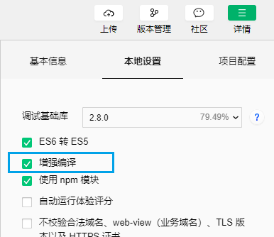
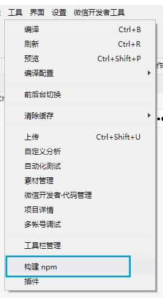

# Quickstart

## Requirement

* [Node.js](https://nodejs.org/en/) (Version 8.9.3 or later)
* [npm](https://www.npmjs.com/package/extract-text-webpack-plugin) (Version 5.5.1 or later)
* [WeChat Developer Tool](https://developers.weixin.qq.com/miniprogram/dev/devtools/download.html) (The latest)<br>
Base library version of the Mini Program: 2.2.1 or later

## How to use
**Step 1**<br>
Open WeChat Developer Tool and create a new project. (Ref. [微信开发者工具](https://developers.weixin.qq.com/miniprogram/dev/devtools/devtools.html))<br>
**Step 2**<br>
Use command tool to run following commands.
```shell
cd your-project-directory
npm init
npm install --save @kintone/kintone-wechat-miniprogram-sdk
```
**Step 3**<br>
At "WeChat Developer Tool"<br>
Check the setting "增强编译". (Ref. [代码编译 - 增强编译](https://developers.weixin.qq.com/miniprogram/dev/devtools/codecompile.html#%E5%A2%9E%E5%BC%BA%E7%BC%96%E8%AF%91))<br>
<br>
Click "工具" > "构建npm" (Ref. [npm 支持](https://developers.weixin.qq.com/miniprogram/dev/devtools/npm.html))<br>
<br>

## Code example

<details class="tab-container" open>
<Summary>Get record sample</Summary>

<strong class="tab-name">Source code</strong>
<pre class="inline-code">

    const kintone = require('@kintone/kintone-wechat-miniprogram-sdk');

    let kintoneAuthWithAPIToken = (new kintone.Auth()).setApiToken({apiToken: 'MY_TOKEN'});
    let kintoneConnection = new kintone.Connection({domain: 'your.FQDN.tld', auth: kintoneAuthWithAPIToken});

    let kintoneRecord = new kintone.Record({connection: kintoneConnection});


    let appID = 'your_app_id';
    let recordID = 'record_id_that_will_be_retrived';
    kintoneRecord.getRecord({app: appID, id: recordID})
        .then((rsp) => {
            console.log(rsp);
        })
        .catch((err) => {
            // The promise function always reject with KintoneAPIException
            console.log(err.get());
        });

</pre>
<strong class="tab-name">Response success</strong>
<pre class="inline-code">

    {
        "record":{
            // record data should be here
        }
    }

</pre>
<strong class="tab-name">Response error</strong>
<pre class="inline-code">

    {
        id: '{ID}',
        code: '{CODE}',
        message: '{Message string}',
        errors: '{JSON String}'
    }

</pre>
</details>

<details class="tab-container" open>
<Summary>Get record sample with Async</Summary>

<strong class="tab-name">Source code</strong>

<pre class="inline-code">

    const kintone = require('@kintone/kintone-wechat-miniprogram-sdk');

    let kintoneAuthWithAPIToken = (new kintone.Auth()).setApiToken({apiToken: 'MY_TOKEN'});
    let kintoneConnection = new kintone.Connection({domain: 'your.FQDN.tld', auth: kintoneAuthWithAPIToken});

    let kintoneRecord = new kintone.Record({connection: kintoneConnection});

    let appID = 'your_app_id';
    let recordID = 'record_id_that_will_be_retrived';
    let getRecord = async () => {
        try {
            let recordResult = await kintoneRecord.getRecord({app: appID, id: recordID});
            console.log(recordResult);
        } catch (error) {
            // The promise function always reject with KintoneAPIException
            console.log(error.get());
        }
    }
    getRecord();

</pre>

<strong class="tab-name">Response success</strong>

<pre class="inline-code">
    {
        "record":{
            // record data should be here
        }
    }
</pre>

<strong class="tab-name">Response error</strong>

<pre class="inline-code">
    { 
        id: '{ID}',
        code: '{CODE}',
        message: '{Message string}',
        errors: '{JSON String}'
    }
</pre>

</details>